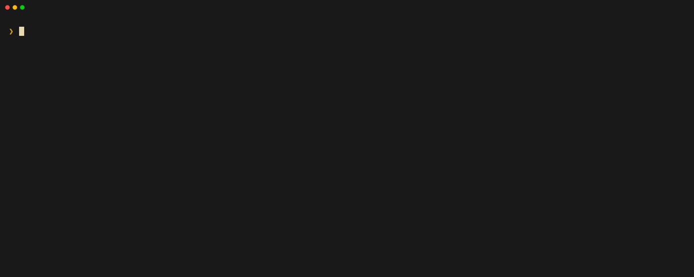
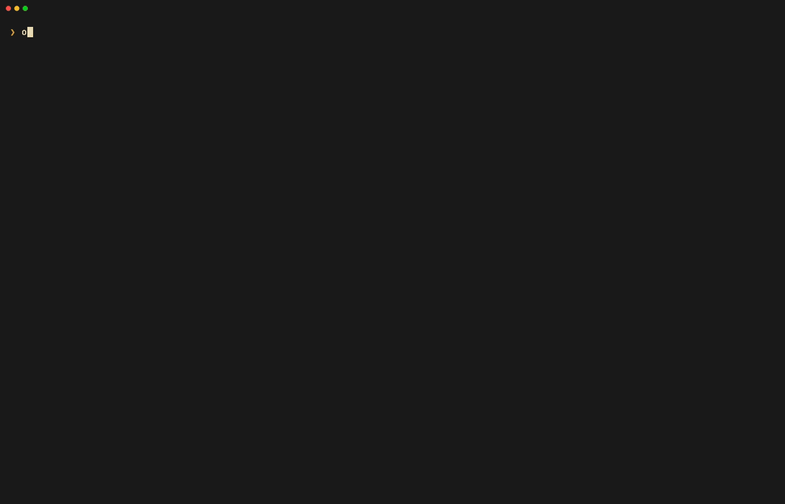
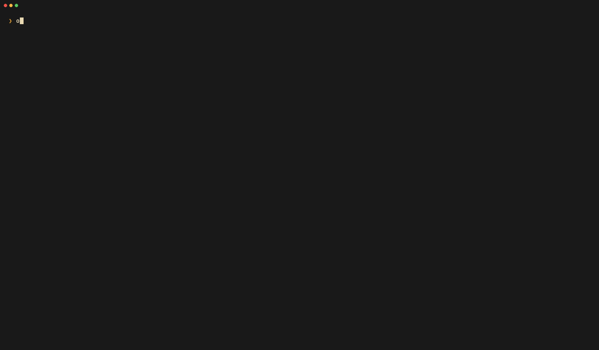
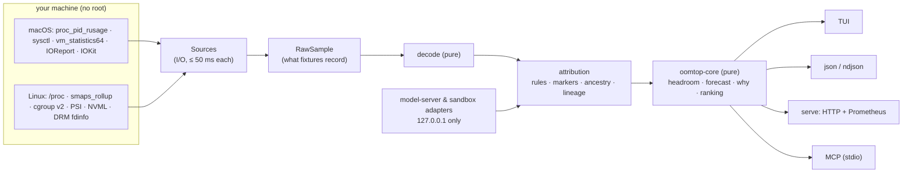

<div align="center">

# oomtop

### See the OOM coming.

**Who's eating your machine: agents, models, sandboxes.**

A terminal resource monitor for local AI work on **macOS and Linux**, with true memory accounting, every process
attributed to the agent, app, sandbox or model server that owns it, and a straight answer to
*"can I load this model right now?"*

[](https://github.com/iprajax/oomtop/actions/workflows/ci.yml)


**[Website](https://iprajax.github.io/oomtop/) · [Install](docs/INSTALL.md) · [Changelog](CHANGELOG.md) · [Contributing](CONTRIBUTING.md) · [Security](SECURITY.md)**


<sub>Live TUI: per-core meters (E/P cores), a memory bar split by what really holds RAM, a one-line verdict, grouped
processes, and “why is this here?” on any row.</sub>

</div>

---

## What it answers

| Question | Command | What you get |
|---|---|---|
| What's really using my memory? | `oomtop` | footprint/PSS (not RSS) incl. GPU/Metal, compressed and swap, grouped by agent / app / model server / sandbox |
| Will this model fit right now? | `oomtop headroom --need 13G` | yes · yes-after-reclaim · no, with the shortfall; exit `0` / `3` / `4` for scripts |
| What can I safely stop? | `oomtop reclaim --dry-run` | idle build daemons, orphans from ended agent sessions, idle model servers, largest gain first |
| Why is it slow? | `oomtop why` | swap storms, pressure, thermal throttling, Low Power Mode, ranked with evidence, plus an OOM forecast |

The first line of the TUI is the answer, then the numbers:

> *Tight on memory: 1.2 GB headroom. sd-server holds 9.9 GB; 2 idle build daemons could free 5.9 GB.* `[r]`

---

## What you get

<table>
<tr>
<td width="50%" valign="top">

### 1 · An htop you already know how to read
Per-core bars (tagged **E**/**P** on Apple Silicon), `Mem[…]` and `Swp[…]` meters, Tasks · Load · Uptime, and
the familiar **F1–F10** bar: Help, Setup, Search, Filter, Tree, SortBy, Why, Reclaim, Stop, Quit. It works in every
key preset (default, vim, emacs, htop).

</td>
<td width="50%" valign="top">

### 2 · Memory that tells the truth
The `Mem` bar is split by what really holds RAM: **apps `|` · GPU/Metal `#` · compressed `*` · wired `=` ·
cache `.`**. The glyphs differ, so it reads without color. Per process: macOS `phys_footprint` (includes Metal),
Linux PSS/SwapPss + NVML/DRM GPU memory. Never RSS alone, and every number carries its source.

</td>
</tr>
</table>

### 3 · Things, not PIDs: every process has an owner


oomtop groups ~800 processes into the **agent session** (Claude Code, Codex, Cursor, Aider, Gemini, Goose…),
**app**, **model server** (Ollama, llama.cpp, sd.cpp, vLLM, LM Studio, MLX), **sandbox** (Virtualization.framework
VMs, Docker/OrbStack/Podman, Firecracker, bubblewrap, Seatbelt…) or **build daemon** that owns them. It uses cgroups,
macOS responsible-pid, ancestry, session markers and rules, and shows a confidence for each group. Children that
outlive their session show up as **orphans**. Things that cost memory and do nothing show up as **idle**, sorted by
how much RAM you'd get back.

<sub>Replay of a recorded snapshot: <code>oomtop --replay fixtures/macos/m5-air-agents.json</code>.</sub>

### 4 · “Can I load this model now?”, answered in one command


Headroom = what the OS can give you now, minus a safety margin. On Apple Silicon it also checks the **Metal GPU
budget**. Give it bytes or a model file: `--model x.gguf` reads only the GGUF header (layers, KV heads, context)
to estimate weights + KV cache + buffers. The exit code is made for scripts:

| exit | meaning |
|---|---|
| `0` | fits now |
| `3` | fits **after reclaim**: it names exactly what to stop and how much that frees |
| `4` | doesn't fit, with the shortfall |
| `1` / `2` | couldn't measure / usage error |

```sh
oomtop headroom --model ~/models/qwen2.5-14b-q4_k_m.gguf --ctx 8192 && ./start-server.sh
```

### 5 · Reclaim safely, and know why it's slow



- **Reclaim** lists idle build daemons, orphans and idle model servers, largest gain first, with the RAM you'd
  actually get back (an estimate, and labeled as one). Nothing is stopped without confirmation. Model servers are
  unloaded through their own API first (e.g. Ollama `keep_alive: 0`), then SIGTERM. SIGKILL needs a second, explicit
  yes. System processes, your terminal, other users' processes and the agent session asking are protected.
- **`oomtop why`** ranks causes with evidence: swap storms (+600 MB/min), memory pressure / PSI, thermal pressure,
  **Low Power Mode**, battery, GPU clocks. Throttling is only reported **under load**, since Apple Silicon also
  down-clocks when idle.
- **OOM forecast**: when swap or available memory trends steadily toward a killer's threshold (kernel OOM,
  systemd-oomd, earlyoom, macOS jetsam), the headline says *"Swap full in ~6 min at this rate"* and names the
  likely victim. A single spike never triggers it.

### 6 · Agents ask before they load (MCP)


```console
$ claude mcp add oomtop -- oomtop mcp
```

Read-only tools: `get_headroom`, `can_fit`, `top_consumers`, `list_groups`, `list_model_servers`, `list_sandboxes`,
`explain_slowdown`, `suggest_reclaim`. With `--allow-actions` there is also `reclaim`, and oomtop itself asks
*you* through MCP elicitation before stopping anything. It samples only when called, so four agents running four
MCP servers cost nothing while idle. Setup for Codex, Cursor and Claude Desktop: [docs/mcp.md](docs/mcp.md).

<table>
<tr>
<td width="50%" valign="top">

### 7 · Honest about what it can't see



`oomtop doctor` lists every source as **ok / partial / unavailable (reason)** and every terminal capability it
detected. Missing data is shown as *n/a* with a reason, never as a silent zero.

</td>
<td width="50%" valign="top">

### 8 · Your terminal is the theme



The default `terminal` theme uses your terminal's own 16 colors and **never paints a background**. Opt-in themes:
`mono`, `ember`, `mint`, `sand`, `coral`, `high-contrast`, `colorblind`, `none`. You can also import base16, iTerm2,
Ghostty, Kitty or Alacritty themes. `NO_COLOR`, `--plain` (screen readers) and `--ascii` are supported.

</td>
</tr>
</table>

---

## Install

> **Pre-release (v0.1.0).** Build from source today. The release archives, Homebrew tap and install script go
> live with the first tagged release.

```console
$ git clone https://github.com/iprajax/oomtop && cd oomtop
$ cargo build --release -p oomtop-cli          # Rust 1.88+; binary at target/release/oomtop
$ ./target/release/oomtop                      # or: cargo install --path crates/oomtop-cli --locked
```

After the first release:

```console
$ brew install iprajax/oomtop/oomtop
$ curl -fsSL https://github.com/iprajax/oomtop/releases/latest/download/install.sh | sh   # verifies SHA-256
$ cargo install oomtop-cli --locked
```

Every other channel (cargo-binstall, npm, PyPI, AUR, Nix, Docker/GHCR, mise, eget, ubi) and its status:
[docs/INSTALL.md](docs/INSTALL.md).

| Platform | Notes |
|---|---|
| macOS 13+ on Apple Silicon (primary) | GPU/power via IOReport (resolved at runtime; degrades cleanly). Intel Macs: best effort |
| Linux x86_64 / aarch64, glibc ≥ 2.28 | NVIDIA via NVML (loaded at runtime), AMD/Intel via DRM fdinfo, PSI, cgroup v2 |
| Linux, fully static (musl) | everything except NVML |

## Use

```console
$ oomtop                          # the TUI
$ oomtop headroom --need 13G      # exit 0 yes · 3 after reclaim · 4 no
$ oomtop why                      # ranked causes of slowness / pressure, with evidence
$ oomtop reclaim --dry-run        # what's idle and what stopping it would free
$ oomtop models                   # model files on disk: size, last use, duplicates, who has them loaded
$ oomtop json | oomtop ndjson     # redacted, versioned snapshots for scripts
$ oomtop serve                    # HTTP JSON + Prometheus /metrics on 127.0.0.1:9469
$ oomtop mcp                      # MCP server for agents
$ oomtop doctor                   # what was measured, what wasn't, and why
```

### Keys

| | |
|---|---|
| **F-keys** (htop) | `F1` Help · `F2` Setup · `F3` Search · `F4` Filter · `F5` Tree · `F6` SortBy · `F7` Why · `F8` Reclaim · `F9` Stop · `F10` Quit |
| Move | `↑↓` / `jk` · `enter` expand · `g`/`G` top/bottom |
| Views | `1` Home · `2` Processes · `3` Models · `4` Sandboxes · `5` Reclaim · `6` Timeline |
| Find | `/` filter (`mem>2G kind:daemon idle>30m`, `gpu hogs`, `claude`) · `:` command · `Ctrl-K` palette |
| Act (always confirms) | `x` stop · `z` suspend (CPU relief only; frees no memory) |
| Make it yours | `p` pin · `m` mute · `n` rename · `i` why ranked here · `w` watch · `c` compare · `,` settings |

<sub>On macOS the F-keys may control brightness/volume. Use <code>fn</code>+F-key, or the letter keys.</sub>

## How it works



- **No daemon.** The TUI and `serve` sample while they run. MCP samples per call (two samples 250 ms apart).
- **Pure core, replayable collectors.** Every OS reading is recorded as a `RawSample` and decoded by pure code, so
  the whole pipeline replays on any OS in CI. `--replay` lets you run oomtop against someone else's machine.
- **Cheap.** Measured on the M5 Air over 11 minutes: TUI **0.96 % of one core, 31 MB RSS**; headless 0.8 %, 24 MB.

## How it compares

| | htop / btop | Activity Monitor | agtop | macmon / mactop | **oomtop** |
|---|:-:|:-:|:-:|:-:|:-:|
| macOS footprint / Linux PSS (not RSS) | – | ✓ | – | – | **✓** |
| Apple GPU / power, no sudo | – | partial | – | ✓ | **✓** |
| Processes grouped by agent session / app / sandbox / model server | – | – | agents only | – | **✓** |
| "Can I load X GB?" + script exit codes | – | – | – | – | **✓** |
| OOM forecast with the likely victim | – | – | – | – | **✓** |
| Safe reclaim of idle daemons / orphans | kill only | quit only | – | – | **✓** |
| MCP server for agents | – | – | – | – | **✓** |
| Token / cost tracking | – | – | **✓** | – | not a goal |

## Safety and privacy

- **Nothing is stopped without confirmation.** Actions target whole groups, with the identity re-checked
  (`pid` + start time) right before signalling. SIGTERM first; SIGKILL only on a second explicit yes.
- **Command lines are redacted** in every export. Environments are read only for an allowlist of session-marker
  keys (hashed, never stored).
- **Local only.** No telemetry. `serve` binds 127.0.0.1. Learning (what you open and pin) is local SQLite:
  `--no-learn` turns it off, `oomtop profile reset` forgets it. `general.other_users = false` hides other
  accounts' processes, like htop's user filter.

## Status

**v0.1.0, pre-release.** 737 tests pass on macOS. On Linux (aarch64, in a local VM), 689 tests pass and 1 is skipped. Footprint
matches `top` within 0.2 % on the M5 Air. Not yet done: the first CI run on GitHub, signed/notarized release
builds, and live tests of throttling on an NVIDIA box and of the 10 GB model-server scenario (both covered by
recorded fixtures today). Details: [SPEC.md](SPEC.md) (system design, §17 acceptance, §18 milestones) and
[UX.md](UX.md) (terminal UX).

## Contributing

```console
$ cargo fmt --all --check && cargo clippy --workspace --all-targets -- -D warnings && cargo test --workspace
$ vhs docs/tapes/headroom.tape     # re-record a README GIF (all tapes live in docs/tapes/)
```

The architecture contract is [docs/CONTRACTS.md](docs/CONTRACTS.md). Ground-truth checks against `top`,
`vm_stat`, `/proc` and `free` are in [tools/groundtruth](tools/groundtruth/README.md). Linux checks from a Mac run
via [tools/linux-vm](tools/README.md).

## License

[MIT](LICENSE)
